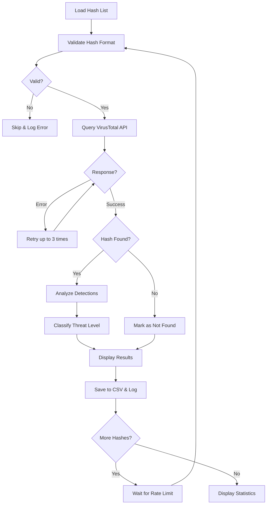

# 🔍 Get-VTReport
> PowerShell script for batch scanning file hashes against VirusTotal database

[](https://github.com/PowerShell/PowerShell)
[](LICENSE)
[](https://www.virustotal.com/)
[]()

---

## 📖 Description

**VirusTotal Hash Checker** is a PowerShell script that automates the process of checking file hashes (MD5, SHA1, SHA256) against the VirusTotal database. It processes batch lists of hashes, respects API rate limits, and generates detailed CSV reports with threat level classifications.

### ✨ Key Features

- 🔄 **Batch processing** of multiple file hashes from a text file
- 🔐 **Multi-hash support** (MD5, SHA1, SHA256)
- 📊 **Threat level classification** (Clean, Low, Suspicious, Malicious)
- 📈 **Progress tracking** with real-time status updates
- 📝 **Detailed logging** with timestamps
- 📧 **CSV export** for easy analysis in Excel/spreadsheet tools
- ⚡ **Auto-retry** mechanism for failed API requests
- 🎯 **Rate limit compliance** (Free & Premium API)
- 🎨 **Color-coded results** for quick identification
- 📉 **Statistics summary** at completion

---

## 🚀 Quick Start

### Prerequisites

- Windows PowerShell 5.1 or higher
- VirusTotal API key (free or premium)
- Internet connection

### Getting Your API Key

1. Visit [VirusTotal](https://www.virustotal.com/gui/join-us)
2. Create a free account or sign in
3. Go to your profile settings
4. Copy your API key from the API Key section

### Installation

1. Download the script:
```powershell
# Download the script
Invoke-WebRequest -Uri "https://raw.githubusercontent.com/jbianco-prog/Get-VTReport/refs/heads/main/Get-VTReport.ps1" -OutFile "Get-VTReport.ps1"
```

2. Create your hash list file (`MD5_list_only.txt`):
```text
5d41402abc4b2a76b9719d911017c592
098f6bcd4621d373cade4e832627b4f6
5f4dcc3b5aa765d61d8327deb882cf99
```

3. Configure the script (lines 16-46):
```powershell
# Set your VirusTotal API key
$VTApiKey = "your_actual_api_key_here"

# Configure file paths
$HashListFile = ".\MD5_list_only.txt"
$ResultFile = ".\Result_VT.csv"
$LogFile = ".\VT_Check_Log.txt"
```

4. Run the script:
```powershell
.\VT-HashChecker.ps1
```

---

## ⚙️ How It Works



### Process Flow

1. **Initialization**: Validates API key and loads hash list
2. **Hash Validation**: Checks format (MD5/SHA1/SHA256)
3. **API Query**: Sends hash to VirusTotal with retry mechanism
4. **Result Processing**: Analyzes detection results
5. **Threat Classification**: Assigns threat level based on detections
6. **Output**: Saves to CSV and displays color-coded results
7. **Rate Limiting**: Waits between requests to respect API limits
8. **Statistics**: Generates final summary report

---

## 🧰 Configuration Parameters

### API Configuration

| Variable | Description | Default | Notes |
|----------|-------------|---------|-------|
| `$VTApiKey` | Your VirusTotal API key | Required | Get from virustotal.com |
| `$VTApiVersion` | API version to use | `"v2"` | v2 or v3 |
| `$sleepTime` | Delay between requests (seconds) | `16` | Free API: 4/min = 15s minimum |
| `$maxRetries` | Max retry attempts on error | `3` | Recommended: 3-5 |

### File Paths

| Variable | Description | Default |
|----------|-------------|---------|
| `$HashListFile` | Input file with hash list | `.\MD5_list_only.txt` |
| `$ResultFile` | Output CSV file | `.\Result_VT.csv` |
| `$LogFile` | Log file path | `.\VT_Check_Log.txt` |

### Display Settings

| Variable | Description | Default | Options |
|----------|-------------|---------|---------|
| `$colorPositive` | Color for detections | `Magenta` | Any PowerShell color |
| `$colorNegative` | Color for clean files | `Green` | Any PowerShell color |
| `$colorWarning` | Color for warnings | `Yellow` | Any PowerShell color |
| `$showProgress` | Show progress bar | `$true` | true/false |

### Threat Classification

| Variable | Description | Default |
|----------|-------------|---------|
| `$suspiciousThreshold` | Detections for "Suspicious" | `5` |
| `$maliciousThreshold` | Detections for "Malicious" | `10` |

### Threat Levels Explained

- **Clean** (0 detections): No AV engines detected threats
- **Low** (1-4 detections): Minimal detections, possible false positives
- **Suspicious** (5-9 detections): Multiple detections, investigate further
- **Malicious** (10+ detections): High confidence malware

---

## 📊 Input File Format

Create a text file with one hash per line. Supported formats:

### MD5 Hashes (32 characters)
```text
5d41402abc4b2a76b9719d911017c592
098f6bcd4621d373cade4e832627b4f6
```

### SHA1 Hashes (40 characters)
```text
aaf4c61ddcc5e8a2dabede0f3b482cd9aea9434d
7c4a8d09ca3762af61e59520943dc26494f8941b
```

### SHA256 Hashes (64 characters)
```text
e3b0c44298fc1c149afbf4c8996fb92427ae41e4649b934ca495991b7852b855
2c26b46b68ffc68ff99b453c1d30413413422d706483bfa0f98a5e886266e7ae
```

### Mixed Format Example
```text
5d41402abc4b2a76b9719d911017c592
aaf4c61ddcc5e8a2dabede0f3b482cd9aea9434d
e3b0c44298fc1c149afbf4c8996fb92427ae41e4649b934ca495991b7852b855
```

**Notes:**
- Empty lines are automatically skipped
- Invalid hash formats are logged and skipped
- Case insensitive (uppercase or lowercase accepted)

---

## 📄 Output Files

### CSV Report (`Result_VT.csv`)

The script generates a CSV file with the following columns:

| Column | Description | Example |
|--------|-------------|---------|
| Hash | The file hash | `5d41402abc4b2a76b9719d911017c592` |
| Hash_Type | Type of hash | `MD5`, `SHA1`, `SHA256` |
| Scan_Date | Last scan date on VT | `2025-10-16 14:30:25` |
| Detections | Number of positive detections | `15` |
| Total_Engines | Total AV engines scanned | `70` |
| Detection_Rate | Percentage of detections | `21.43%` |
| Threat_Level | Classification | `Clean`, `Low`, `Suspicious`, `Malicious` |
| Permalink | VirusTotal report URL | `https://www.virustotal.com/...` |

**Example CSV:**
```csv
Hash;Hash_Type;Scan_Date;Detections;Total_Engines;Detection_Rate;Threat_Level;Permalink
5d41402abc4b2a76b9719d911017c592;MD5;2025-10-16 14:30:25;15;70;21.43%;Suspicious;https://www.virustotal.com/gui/file/...
098f6bcd4621d373cade4e832627b4f6;MD5;2025-10-15 08:15:42;0;69;0%;Clean;https://www.virustotal.com/gui/file/...
```

### Log File (`VT_Check_Log.txt`)

Detailed execution log with timestamps:

```text
16/10/2025 14:30:00 :: START :: Log file created
16/10/2025 14:30:00 :: INFO :: Result file initialized: .\Result_VT.csv
16/10/2025 14:30:00 :: INFO :: Starting scan of 25 hashes
16/10/2025 14:30:15 :: INFO :: Hash: 5d41402abc... | Detections: 15/70 | Level: Suspicious
16/10/2025 14:30:31 :: INFO :: Hash: 098f6bcd... | Detections: 0/69 | Level: Clean
16/10/2025 14:30:47 :: WARNING :: Rate limit reached for hash: 5f4dcc3b...
16/10/2025 14:32:00 :: INFO :: Scan completed - Total: 25 | Clean: 18 | Suspicious: 5 | Malicious: 2
16/10/2025 14:32:00 :: END :: Scan session ended
```

---

## 🎨 Console Output Example

```
============================================
  VirusTotal Hash Checker v2.0
============================================

Loaded 10 hashes from file.
API delay: 16 seconds between requests

[1/10] Checking hash: 5d41402abc4b2a76b9719d911017c592
  Scan Date 
