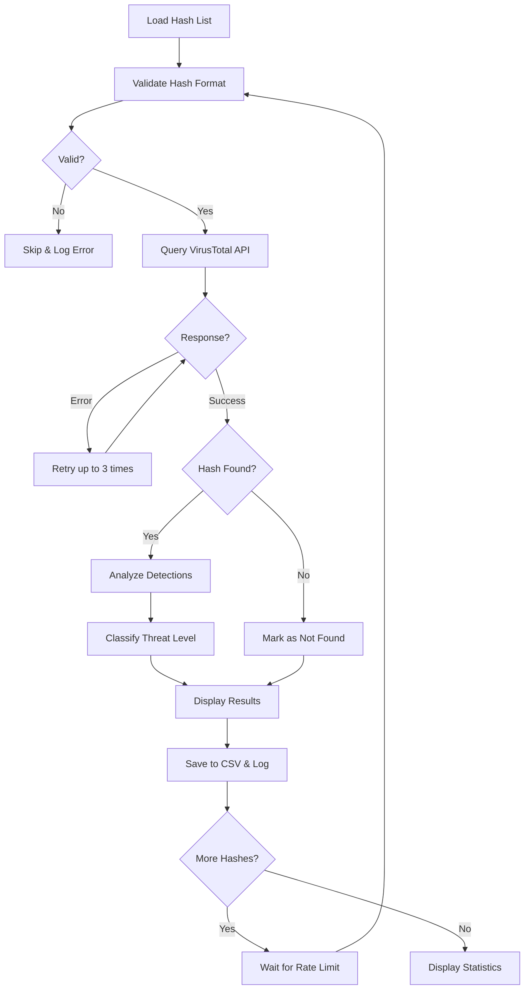

# 🔍 Get-VTReport
> PowerShell script for batch scanning file hashes against VirusTotal database

[](https://github.com/PowerShell/PowerShell)
[](LICENSE)
[](https://www.virustotal.com/)
[]()

---

## 📖 Description

**Get-VTReport** is a PowerShell script that automates the process of checking file hashes (MD5, SHA1, SHA256) against the VirusTotal database. It processes batch lists of hashes, respects API rate limits, and generates detailed CSV reports with threat level classifications.

### ✨ Key Features

- 🔄 **Batch processing** of multiple file hashes from a text file
- 🔐 **Multi-hash support** (MD5, SHA1, SHA256)
- 📊 **Threat level classification** (Clean, Low, Suspicious, Malicious)
- 📈 **Progress tracking** with real-time status updates
- 📝 **Detailed logging** with timestamps
- 📧 **CSV export** for easy analysis in Excel/spreadsheet tools
- ⚡ **Auto-retry** mechanism for failed API requests
- 🎯 **Rate limit compliance** (Free & Premium API)
- 🎨 **Color-coded results** for quick identification
- 📉 **Statistics summary** at completion

---

## 🚀 Quick Start

### Prerequisites

- Windows PowerShell 5.1 or higher
- VirusTotal API key (free or premium)
- Internet connection

### Getting Your API Key

1. Visit [VirusTotal](https://www.virustotal.com/gui/join-us)
2. Create a free account or sign in
3. Go to your profile settings
4. Copy your API key from the API Key section

### Installation

1. Download the script:
```powershell
# Download the script
Invoke-WebRequest -Uri "https://raw.githubusercontent.com/jbianco-prog/Get-VTReport/refs/heads/main/Get-VTReport.ps1" -OutFile "Get-VTReport.ps1"
```

2. Create your hash list file (`MD5_HashList.txt`):
```text
5d41402abc4b2a76b9719d911017c592
098f6bcd4621d373cade4e832627b4f6
5f4dcc3b5aa765d61d8327deb882cf99
```

3. Configure the script (lines 16-46):
```powershell
# Set your VirusTotal API key
$VTApiKey = "your_actual_api_key_here"

# Configure file paths
$HashListFile = ".\MD5_HashList.txt"
$ResultFile = ".\VTReport_Result.csv"
$LogFile = ".\VTReport_Log.txt"
```

4. Run the script:
```powershell
.\Get-VTReport.ps1
```

---

## ⚙️ How It Works



### Process Flow

1. **Initialization**: Validates API key and loads hash list
2. **Hash Validation**: Checks format (MD5/SHA1/SHA256)
3. **API Query**: Sends hash to VirusTotal with retry mechanism
4. **Result Processing**: Analyzes detection results
5. **Threat Classification**: Assigns threat level based on detections
6. **Output**: Saves to CSV and displays color-coded results
7. **Rate Limiting**: Waits between requests to respect API limits
8. **Statistics**: Generates final summary report

---

## 🧰 Configuration Parameters

### API Configuration

| Variable | Description | Default | Notes |
|----------|-------------|---------|-------|
| `$VTApiKey` | Your VirusTotal API key | Required | Get from virustotal.com |
| `$VTApiVersion` | API version to use | `"v2"` | v2 tested, v3 compatible |
| `$sleepTime` | Delay between requests (seconds) | `16` | Free API: 4/min = 15s minimum |
| `$maxRetries` | Max retry attempts on error | `3` | Recommended: 3-5 |

### File Paths

| Variable | Description | Default |
|----------|-------------|---------|
| `$HashListFile` | Input file with hash list | `.\MD5_HashList.txt` |
| `$ResultFile` | Output CSV file | `.\VTReport_Result.csv` |
| `$LogFile` | Log file path | `.\VTReport_Log.txt` |

### Display Settings

| Variable | Description | Default | Options |
|----------|-------------|---------|---------|
| `$colorPositive` | Color for detections | `Magenta` | Any PowerShell color |
| `$colorNegative` | Color for clean files | `Green` | Any PowerShell color |
| `$colorWarning` | Color for warnings | `Yellow` | Any PowerShell color |
| `$showProgress` | Show progress bar | `$true` | true/false |

### Threat Classification

| Variable | Description | Default |
|----------|-------------|---------|
| `$suspiciousThreshold` | Detections for "Suspicious" | `2` |
| `$maliciousThreshold` | Detections for "Malicious" | `4` |

### Threat Levels Explained

- **Clean** (0 detections): No AV engines detected threats
- **Low** (1 detection): Single detection, likely false positive
- **Suspicious** (2-3 detections): Multiple detections, investigate further
- **Malicious** (4+ detections): High confidence malware

---

## 📊 Input File Format

Create a text file with one hash per line. Supported formats:

### MD5 Hashes (32 characters)
```text
5d41402abc4b2a76b9719d911017c592
098f6bcd4621d373cade4e832627b4f6
```

### SHA1 Hashes (40 characters)
```text
aaf4c61ddcc5e8a2dabede0f3b482cd9aea9434d
7c4a8d09ca3762af61e59520943dc26494f8941b
```

### SHA256 Hashes (64 characters)
```text
e3b0c44298fc1c149afbf4c8996fb92427ae41e4649b934ca495991b7852b855
2c26b46b68ffc68ff99b453c1d30413413422d706483bfa0f98a5e886266e7ae
```

### Mixed Format Example
```text
5d41402abc4b2a76b9719d911017c592
aaf4c61ddcc5e8a2dabede0f3b482cd9aea9434d
e3b0c44298fc1c149afbf4c8996fb92427ae41e4649b934ca495991b7852b855
```

**Notes:**
- Empty lines are automatically skipped
- Invalid hash formats are logged and skipped
- Case insensitive (uppercase or lowercase accepted)

---

## 📄 Output Files

### CSV Report (`VTReport_Result.csv`)

The script generates a CSV file with the following columns:

| Column | Description | Example |
|--------|-------------|---------|
| Hash | The file hash | `5d41402abc4b2a76b9719d911017c592` |
| Hash_Type | Type of hash | `MD5`, `SHA1`, `SHA256` |
| Scan_Date | Last scan date on VT | `2025-10-16 14:30:25` |
| Detections | Number of positive detections | `15` |
| Total_Engines | Total AV engines scanned | `70` |
| Detection_Rate | Percentage of detections | `21.43%` |
| Threat_Level | Classification | `Clean`, `Low`, `Suspicious`, `Malicious` |
| Permalink | VirusTotal report URL | `https://www.virustotal.com/...` |

**Example CSV:**
```csv
Hash;Hash_Type;Scan_Date;Detections;Total_Engines;Detection_Rate;Threat_Level;Permalink
5d41402abc4b2a76b9719d911017c592;MD5;2025-10-16 14:30:25;15;70;21.43%;Suspicious;https://www.virustotal.com/gui/file/...
098f6bcd4621d373cade4e832627b4f6;MD5;2025-10-15 08:15:42;0;69;0%;Clean;https://www.virustotal.com/gui/file/...
```

### Log File (`VTReport_Log.txt`)

Detailed execution log with timestamps:

```text
16/10/2025 14:30:00 :: START :: Log file created
16/10/2025 14:30:00 :: INFO :: Result file initialized: .\VTReport_Result.csv
16/10/2025 14:30:00 :: INFO :: Starting scan of 25 hashes
16/10/2025 14:30:15 :: INFO :: Hash: 5d41402abc... | Detections: 15/70 | Level: Suspicious
16/10/2025 14:30:31 :: INFO :: Hash: 098f6bcd... | Detections: 0/69 | Level: Clean
16/10/2025 14:30:47 :: WARNING :: Rate limit reached for hash: 5f4dcc3b...
16/10/2025 14:32:00 :: INFO :: Scan completed - Total: 25 | Clean: 18 | Suspicious: 5 | Malicious: 2
16/10/2025 14:32:00 :: END :: Scan session ended
```

---

## 🎨 Console Output Example

```
============================================
  VirusTotal Hash Checker v2.0
============================================

Loaded 10 hashes from file.
API delay: 16 seconds between requests

[1/10] Checking hash: 5d41402abc4b2a76b9719d911017c592
  Scan Date   : 2025-10-16 14:30:25
  Detections  : 15/70 (21.43%)
  Threat Level: Suspicious
  Permalink   : https://www.virustotal.com/gui/file/...

[2/10] Checking hash: 098f6bcd4621d373cade4e832627b4f6
  Scan Date   : 2025-10-15 08:15:42
  Detections  : 0/69 (0%)
  Threat Level: Clean
  Permalink   : https://www.virustotal.com/gui/file/...

============================================
  SCAN COMPLETE - STATISTICS
============================================

Total hashes processed : 10
Clean files            : 7
Suspicious files       : 2
Malicious files        : 1
Not found in database  : 0
Errors                 : 0

Duration               : 0h 3m 12s

Results saved to       : .\VTReport_Result.csv
Log file saved to      : .\VTReport_Log.txt

============================================
```

---

## 🔧 Advanced Usage

### Custom Threat Thresholds

Adjust thresholds based on your security requirements:

```powershell
# Strict mode (lower thresholds)
$suspiciousThreshold = 1
$maliciousThreshold = 2

# Lenient mode (higher thresholds)
$suspiciousThreshold = 5
$maliciousThreshold = 10
```

### Premium API Configuration

If you have a premium VirusTotal API key with higher rate limits:

```powershell
# Premium API: 1000 requests per minute
$sleepTime = 1  # 1 second between requests
```

### Processing Large Hash Lists

For very large lists (1000+ hashes):

```powershell
# Disable progress bar for better performance
$showProgress = $false

# Increase retry attempts
$maxRetries = 5
```

### Filtering Results

Use PowerShell to filter the CSV output:

```powershell
# Show only malicious files
Import-Csv .\VTReport_Result.csv -Delimiter ';' | Where-Object { $_.Threat_Level -eq "Malicious" }

# Show files with detection rate > 10%
Import-Csv .\VTReport_Result.csv -Delimiter ';' | Where-Object { [decimal]($_.Detection_Rate -replace '%','') -gt 10 }

# Export suspicious and malicious only
Import-Csv .\VTReport_Result.csv -Delimiter ';' | Where-Object { $_.Threat_Level -in @("Suspicious","Malicious") } | Export-Csv .\Threats_Only.csv -Delimiter ';' -NoTypeInformation
```

---

## 🐛 Troubleshooting

### Common Issues

**1. Invalid API Key Error**
```
ERROR: Please configure your VirusTotal API key in the script!
```
**Solution:**
- Verify your API key is correct (64 characters)
- Ensure no extra spaces before/after the key
- Get a new key from virustotal.com if needed

**2. Rate Limit Exceeded**
```
Rate limit reached. Waiting 60 seconds...
```
**Solution:**
- This is normal for free API (4 requests/minute)
- Script automatically waits and retries
- Consider upgrading to Premium API for higher limits

**3. Hash Not Found in Database**
```
Status: NOT FOUND IN DATABASE
```
**Solution:**
- The file has never been uploaded to VirusTotal
- This is normal for custom/proprietary files
- Consider uploading the actual file to VT manually

**4. Connection Timeout**
```
ERROR: Unable to query VirusTotal API
```
**Solution:**
- Check your internet connection
- Verify firewall allows HTTPS (port 443)
- Check if VirusTotal is accessible from your network

**5. Invalid Hash Format**
```
INVALID HASH FORMAT: abc123
```
**Solution:**
- Ensure hashes are MD5 (32 chars), SHA1 (40 chars), or SHA256 (64 chars)
- Check for typos or extra characters
- Use only hexadecimal characters (0-9, a-f)

---

## 📊 API Rate Limits

### Free API
- **Requests**: 4 per minute (500 per day)
- **Script setting**: `$sleepTime = 16` (recommended 15+ seconds)
- **Best for**: Small to medium hash lists (< 500 hashes)

### Premium API
- **Requests**: 1,000 per minute
- **Script setting**: `$sleepTime = 1` (or less)
- **Best for**: Large-scale scanning operations

**Tip**: The script automatically handles rate limiting by pausing when limits are reached.

---

## 📜 Use Cases

### Security Operations
- **Incident Response**: Quick triage of suspicious file hashes
- **Threat Hunting**: Bulk verification of IOCs (Indicators of Compromise)
- **Malware Analysis**: Pre-screening files before sandbox analysis

### Compliance & Audit
- **File Validation**: Verify integrity of software downloads
- **Baseline Creation**: Document known-good file hashes
- **Audit Trails**: Maintain records of security checks

### Development & Testing
- **Build Verification**: Check build artifacts against VT database
- **Dependency Scanning**: Validate third-party libraries
- **Release Validation**: Ensure clean software releases

---

## 📚 Best Practices

✅ **Do:**
- Use a dedicated API key for automation
- Keep hash lists organized by source/date
- Review logs regularly for errors
- Archive CSV results for compliance
- Use appropriate sleep times for your API tier
- Validate hash quality before submission

❌ **Don't:**
- Share your API key publicly
- Set sleep time below API limits
- Submit sensitive/private file hashes without authorization
- Ignore "Not Found" results (may need file upload)
- Process duplicate hashes (deduplicate first)

---

## 🔗 Related Resources

- [VirusTotal API Documentation](https://developers.virustotal.com/reference)
- [VirusTotal API Key Management](https://www.virustotal.com/gui/user/YOUR_USERNAME/apikey)
- [File Hash Generator Tools](https://emn178.github.io/online-tools/sha256_checksum.html)
- [PowerShell Documentation](https://docs.microsoft.com/en-us/powershell/)

---

## 🤝 Contributing

Contributions are welcome! Please:

1. Fork the repository
2. Create a feature branch (`git checkout -b feature/improvement`)
3. Commit your changes (`git commit -am 'Add new feature'`)
4. Push to the branch (`git push origin feature/improvement`)
5. Open a Pull Request

---

## 📄 License

This project is licensed under the GPL License - see the [LICENSE](LICENSE) file for details.

---

## 👨‍💻 Author

**Micro-one**
- Website: [micro-one.com](https://micro-one.com)
- Email: contact@micro-one.com

---

## 📅 Version History

- **v2.1** (16/10/2025) - Enhanced version with improved logging and error handling
- **v2.0** (16/10/2025) - Major rewrite with configuration section and statistics
- **v1.0** (04/03/2018) - Initial release

---

## ⭐ Support

If you find this script useful, please consider:
- ⭐ Starring the repository
- 🐛 Reporting issues
- 💡 Suggesting improvements
- 📢 Sharing with the security community

---

## ⚠️ Disclaimer

This tool is provided for legitimate security research and analysis purposes only. Users are responsible for:
- Complying with VirusTotal's Terms of Service
- Respecting data privacy and confidentiality
- Following applicable laws and regulations
- Not submitting sensitive or private information

The authors are not responsible for misuse of this tool.

---

**Last updated:** October 16, 2025  
**Version:** 2.1 (Get-VTReport)  
**Tested on:** Windows 10/11, Windows Server 2019/2022, PowerShell 5.1+
