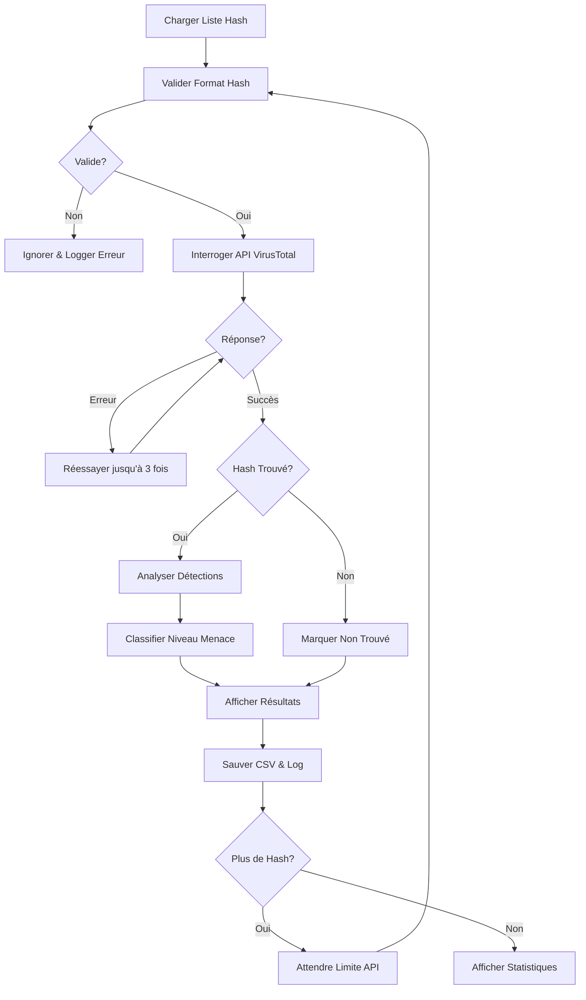

# 🔍 Get-VTReport
> Script PowerShell pour l'analyse par lots de hash de fichiers via la base de données VirusTotal

[](https://github.com/PowerShell/PowerShell)
[](LICENSE)
[](https://www.virustotal.com/)
[]()

---

## 📖 Description

**Get-VTReport** est un script PowerShell qui automatise le processus de vérification de hash de fichiers (MD5, SHA1, SHA256) contre la base de données VirusTotal. Il traite des listes de hash par lots, respecte les limites de l'API et génère des rapports CSV détaillés avec classification des niveaux de menace.

### ✨ Fonctionnalités Principales

- 🔄 **Traitement par lots** de multiples hash depuis un fichier texte
- 🔐 **Support multi-hash** (MD5, SHA1, SHA256)
- 📊 **Classification des menaces** (Clean, Low, Suspicious, Malicious)
- 📈 **Suivi de progression** avec mises à jour en temps réel
- 📝 **Journalisation détaillée** avec horodatage
- 📧 **Export CSV** pour analyse facile dans Excel
- ⚡ **Mécanisme de retry automatique** pour les requêtes échouées
- 🎯 **Respect des limites API** (Free & Premium)
- 🎨 **Résultats en couleur** pour identification rapide
- 📉 **Résumé statistique** à la fin

---

## 🚀 Démarrage Rapide

### Prérequis

- Windows PowerShell 5.1 ou supérieur
- Clé API VirusTotal (gratuite ou premium)
- Connexion internet

### Obtenir Votre Clé API

1. Visitez [VirusTotal](https://www.virustotal.com/gui/join-us)
2. Créez un compte gratuit ou connectez-vous
3. Allez dans les paramètres de votre profil
4. Copiez votre clé API depuis la section API Key

### Installation

1. Téléchargez le script :
```powershell
# Télécharger le script
Invoke-WebRequest -Uri "https://micro-one.com/scripts/Get-VTReport.ps1" -OutFile "Get-VTReport.ps1"
```

2. Créez votre fichier de liste de hash (`MD5_HashList.txt`) :
```text
5d41402abc4b2a76b9719d911017c592
098f6bcd4621d373cade4e832627b4f6
5f4dcc3b5aa765d61d8327deb882cf99
```

3. Configurez le script (lignes 16-46) :
```powershell
# Définir votre clé API VirusTotal
$VTApiKey = "votre_cle_api_reelle_ici"

# Configurer les chemins de fichiers
$HashListFile = ".\MD5_HashList.txt"
$ResultFile = ".\VTReport_Result.csv"
$LogFile = ".\VTReport_Log.txt"
```

4. Exécutez le script :
```powershell
.\Get-VTReport.ps1
```

---

## ⚙️ Fonctionnement



### Flux de Traitement

1. **Initialisation** : Valide la clé API et charge la liste de hash
2. **Validation Hash** : Vérifie le format (MD5/SHA1/SHA256)
3. **Requête API** : Envoie le hash à VirusTotal avec mécanisme de retry
4. **Traitement Résultats** : Analyse les résultats de détection
5. **Classification Menace** : Attribue un niveau basé sur les détections
6. **Sortie** : Sauvegarde en CSV et affiche résultats en couleur
7. **Limite Débit** : Attend entre les requêtes pour respecter l'API
8. **Statistiques** : Génère le rapport final

---

## 🧰 Paramètres de Configuration

### Configuration API

| Variable | Description | Défaut | Notes |
|----------|-------------|--------|-------|
| `$VTApiKey` | Votre clé API VirusTotal | Requis | Obtenir sur virustotal.com |
| `$VTApiVersion` | Version API à utiliser | `"v2"` | v2 testée, v3 compatible |
| `$sleepTime` | Délai entre requêtes (secondes) | `16` | API gratuite : 4/min = 15s minimum |
| `$maxRetries` | Tentatives max en cas d'erreur | `3` | Recommandé : 3-5 |

### Chemins de Fichiers

| Variable | Description | Défaut |
|----------|-------------|--------|
| `$HashListFile` | Fichier d'entrée avec liste hash | `.\MD5_HashList.txt` |
| `$ResultFile` | Fichier CSV de sortie | `.\VTReport_Result.csv` |
| `$LogFile` | Chemin du fichier journal | `.\VTReport_Log.txt` |

### Paramètres d'Affichage

| Variable | Description | Défaut | Options |
|----------|-------------|--------|---------|
| `$colorPositive` | Couleur pour détections | `Magenta` | Toute couleur PowerShell |
| `$colorNegative` | Couleur pour fichiers clean | `Green` | Toute couleur PowerShell |
| `$colorWarning` | Couleur pour avertissements | `Yellow` | Toute couleur PowerShell |
| `$showProgress` | Afficher barre de progression | `$true` | true/false |

### Classification des Menaces

| Variable | Description | Défaut |
|----------|-------------|--------|
| `$suspiciousThreshold` | Détections pour "Suspicious" | `2` |
| `$maliciousThreshold` | Détections pour "Malicious" | `4` |

### Niveaux de Menace Expliqués

- **Clean** (0 détection) : Aucun moteur AV n'a détecté de menace
- **Low** (1 détection) : Détection unique, probablement faux positif
- **Suspicious** (2-3 détections) : Détections multiples, investigation recommandée
- **Malicious** (4+ détections) : Haute confiance de malware

---

## 📊 Format du Fichier d'Entrée

Créez un fichier texte avec un hash par ligne. Formats supportés :

### Hash MD5 (32 caractères)
```text
5d41402abc4b2a76b9719d911017c592
098f6bcd4621d373cade4e832627b4f6
```

### Hash SHA1 (40 caractères)
```text
aaf4c61ddcc5e8a2dabede0f3b482cd9aea9434d
7c4a8d09ca3762af61e59520943dc26494f8941b
```

### Hash SHA256 (64 caractères)
```text
e3b0c44298fc1c149afbf4c8996fb92427ae41e4649b934ca495991b7852b855
2c26b46b68ffc68ff99b453c1d30413413422d706483bfa0f98a5e886266e7ae
```

### Exemple de Format Mixte
```text
5d41402abc4b2a76b9719d911017c592
aaf4c61ddcc5e8a2dabede0f3b482cd9aea9434d
e3b0c44298fc1c149afbf4c8996fb92427ae41e4649b934ca495991b7852b855
```

**Notes :**
- Les lignes vides sont automatiquement ignorées
- Les formats de hash invalides sont journalisés et ignorés
- Insensible à la casse (majuscules ou minuscules acceptées)

---

## 📄 Fichiers de Sortie

### Rapport CSV (`VTReport_Result.csv`)

Le script génère un fichier CSV avec les colonnes suivantes :

| Colonne | Description | Exemple |
|---------|-------------|---------|
| Hash | Le hash du fichier | `5d41402abc4b2a76b9719d911017c592` |
| Hash_Type | Type de hash | `MD5`, `SHA1`, `SHA256` |
| Scan_Date | Date du dernier scan sur VT | `2025-10-16 14:30:25` |
| Detections | Nombre de détections positives | `15` |
| Total_Engines | Total de moteurs AV analysés | `70` |
| Detection_Rate | Pourcentage de détections | `21.43%` |
| Threat_Level | Classification | `Clean`, `Low`, `Suspicious`, `Malicious` |
| Permalink | URL du rapport VirusTotal | `https://www.virustotal.com/...` |

**Exemple CSV :**
```csv
Hash;Hash_Type;Scan_Date;Detections;Total_Engines;Detection_Rate;Threat_Level;Permalink
5d41402abc4b2a76b9719d911017c592;MD5;2025-10-16 14:30:25;15;70;21.43%;Suspicious;https://www.virustotal.com/gui/file/...
098f6bcd4621d373cade4e832627b4f6;MD5;2025-10-15 08:15:42;0;69;0%;Clean;https://www.virustotal.com/gui/file/...
```

### Fichier Journal (`VTReport_Log.txt`)

Journal d'exécution détaillé avec horodatage :

```text
16/10/2025 14:30:00 :: START :: Fichier journal créé
16/10/2025 14:30:00 :: INFO :: Fichier de résultats initialisé : .\VTReport_Result.csv
16/10/2025 14:30:00 :: INFO :: Début du scan de 25 hash
16/10/2025 14:30:15 :: INFO :: Hash: 5d41402abc... | Détections: 15/70 | Niveau: Suspicious
16/10/2025 14:30:31 :: INFO :: Hash: 098f6bcd... | Détections: 
